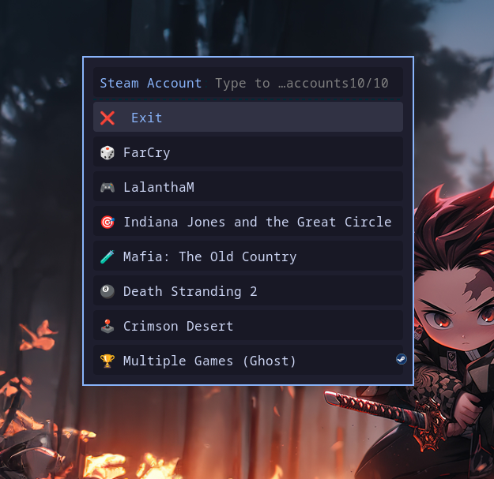

# 🎮 Steam Account Switcher

Switch between multiple Steam accounts instantly — no manual logout, no browser, no fuss.
Available as a **desktop GUI** (PyQt6) and a lightweight **CLI popup** (Bash + rofi).




---

## ✨ Features

- **One-click account switching** — select an account and Steam restarts into it automatically
- **Friendly display names** — map cryptic Steam usernames to custom labels with full emoji support
- **Most-recently-used badge** — always know which account was last active
- **System tray integration** — minimises to the tray, always one click away
- **Live Steam status** — header shows whether Steam is running or stopped
- **Inline alias editor** — add, rename, or remove account labels without touching a config file
- **Auto-detects Steam** — finds `loginusers.vdf` automatically on all standard install paths
- **Clean process management** — waits for Steam to fully exit before relaunching (no zombie processes)

---

## 📋 Requirements

| Dependency | Purpose |
|---|---|
| Python ≥ 3.8 | GUI runtime |
| PyQt6 ≥ 6.4 | Desktop GUI framework |
| Steam | Obviously |

> The installer handles PyQt6 automatically. Python 3.8+ ships with virtually every modern Linux distro.

---

## 🚀 Quick Install

```bash
git clone https://github.com/lalantham/steam-account-switcher.git
cd steam-account-switcher/gui
chmod +x install.sh
./install.sh
```

The installer will:
1. Verify Python 3.8+
2. Install PyQt6 via your system package manager (or pip as fallback)
3. Copy the app to `~/.local/share/steam-account-switcher/`
4. Create a `steam-account-switcher` command in `~/.local/bin/`
5. Register a `.desktop` entry so it appears in your app launcher

---

## 🖥️ Running the App

**From your app launcher** (KDE, GNOME, etc.)
Search for **"Steam Account Switcher"** — the icon appears after install.

**From the terminal**
```bash
steam-account-switcher
```

**Directly (without install)**
```bash
python3 gui/steam_switcher.py
```

---

## 🔧 Manual Install (without the script)

```bash
# 1. Install PyQt6
sudo pacman -S python-pyqt6          # Arch / CachyOS / Manjaro
sudo apt install python3-pyqt6       # Debian / Ubuntu / Mint
sudo dnf install python3-qt6         # Fedora
pip3 install --user PyQt6            # Any distro (pip fallback)

# 2. Copy the app somewhere permanent
mkdir -p ~/.local/share/steam-account-switcher
cp gui/steam_switcher.py ~/.local/share/steam-account-switcher/

# 3. Create a launcher
mkdir -p ~/.local/bin
cat > ~/.local/bin/steam-account-switcher <<'EOF'
#!/bin/bash
exec python3 "$HOME/.local/share/steam-account-switcher/steam_switcher.py" "$@"
EOF
chmod +x ~/.local/bin/steam-account-switcher

# 4. Register the desktop entry
cp gui/steam-account-switcher-gui.desktop ~/.local/share/applications/steam-account-switcher.desktop
# Edit the Exec= line to match your install path, then:
update-desktop-database ~/.local/share/applications/
```

---

## ⚙️ Configuration — `aliases.conf`

The app reads `aliases.conf` to display friendly names instead of raw Steam PersonaNames.

**Default location:** `~/.local/share/steam-account-switcher/aliases.conf`

### Format

```ini
# Steam Account Aliases
# Format: PersonaName=Friendly Label

MickyBro=🎮 Main Account
john_alt99=👾 Horror Games
randomname123=🏆 Competitive Smurf
```

- Keys are **case-sensitive** and must exactly match the `PersonaName` in Steam's login file
- Values support any Unicode text including emoji
- Lines starting with `#` are ignored
- Accounts without an entry are displayed using their raw PersonaName

### Finding your PersonaNames

```bash
grep '"PersonaName"' ~/.steam/root/config/loginusers.vdf | awk -F\" '{print $4}'
```

### Editing aliases in-app

Open the app → click **✏ Manage Aliases** — no need to touch the file manually.

---

## 🗂️ File Structure

```
steam-account-switcher/
│
├── gui/                              # PyQt6 Desktop GUI
│   ├── steam_switcher.py             #   Main application
│   ├── install.sh                    #   Installer
│   ├── uninstall.sh                  #   Uninstaller
│   └── requirements.txt             #   Python dependencies
│
├── steam-accounts.sh                 # CLI version (Bash + rofi)
├── aliases.conf                      # Account display labels (template)
├── steam-account-switcher.desktop    # Desktop entry for CLI version
├── install.sh                        # CLI version installer
└── README.md
```

---

## 🛠️ Troubleshooting

**"No accounts found" in the app**
- Verify the file exists: `ls ~/.steam/root/config/loginusers.vdf`
- Some distros use `~/.local/share/Steam/config/loginusers.vdf` — update the path in **⚙ Settings**
- Make sure you have logged into each account at least once with "Remember me" checked

**App launches but Steam doesn't switch**
- Ensure Steam is fully closed before switching — or let the app kill it (it does this automatically)
- Run from the terminal to see any error output: `steam-account-switcher`

**`steam-account-switcher` command not found after install**
- Add `~/.local/bin` to your PATH:
  ```bash
  echo 'export PATH="$HOME/.local/bin:$PATH"' >> ~/.zshrc   # zsh
  echo 'export PATH="$HOME/.local/bin:$PATH"' >> ~/.bashrc  # bash
  ```
  Then restart your shell or run `source ~/.zshrc`.

**Wrong PersonaName in aliases.conf**
- PersonaNames are case-sensitive. Run the grep command above to get exact strings.
- Or use **✏ Manage Aliases** in the app — it pre-populates all known PersonaNames automatically.

**PyQt6 import error**
- Re-run the installer, or install manually:
  ```bash
  sudo pacman -S python-pyqt6   # Arch-based
  pip3 install --user PyQt6      # Any distro
  ```

---

## 🗑️ Uninstall

```bash
chmod +x gui/uninstall.sh
./gui/uninstall.sh
```

The uninstaller removes the app, launcher, and desktop entry. It offers to keep or back up your `aliases.conf`.

---

## CLI Version (Bash + Rofi)

A minimal alternative that uses a [rofi](https://github.com/davatorium/rofi) popup instead of a full window.

**Install:**
```bash
chmod +x install.sh
./install.sh
```

**Requirements:** `bash ≥ 4.0`, `rofi`, `steam`

---

## 📄 License

MIT — do whatever you want with it.
